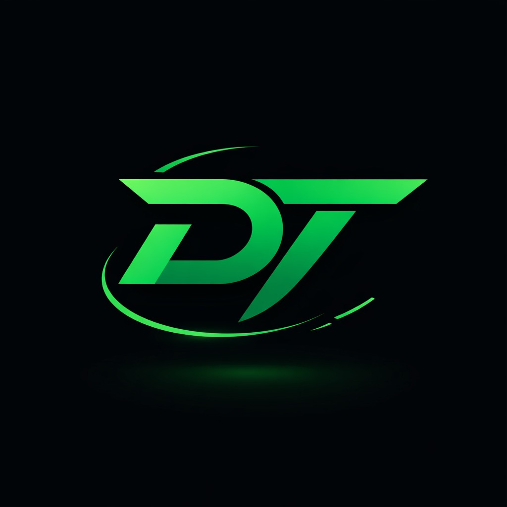

<p align="center">
  
</p>

<h1 align="center">DevTrack</h1>

# DevTrack 🔥🔥💻

A full-stack platform to track competitive programming activity across Codeforces, CodeChef, LeetCode and more.

## 🧩 Project structure
- **backend/** — Express API + MongoDB logic (data gathering, scraping, analytics)
- **frontend/** — React + Vite SPA (dashboard, profile, heatmaps)
- **extension/** — Browser extension (Chrome/Edge) for quick access to contests and the DevTrack dashboard

## 🚀 Running locally
### Backend
```bash
cd backend
npm install
npm run dev
```

### Frontend
```bash
cd frontend
npm install
npm run dev
```

## 🧠 Browser extension (DevTrack Companion)
To run the browser extension locally:
1. Open Chrome / Edge and go to `chrome://extensions` (or `edge://extensions`).
2. Enable **Developer mode**.
3. Click **Load unpacked** and select the `extension/` folder in this repo.
4. Click the DevTrack Companion toolbar icon to view upcoming contests.

> Tip: The extension defaults to `http://localhost:3000` for the API and assumes the frontend runs at `http://localhost:5173`. If you run your services on different ports, update the URL in the extension popup and/or in `extension/popup.js`.
>
> ### Using the dashboard stats feature
> 1. Log in to DevTrack in your browser (frontend).
> 2. Open DevTools > Application > Local Storage and copy `session` → `user.id` and `access_token`.
> 3. In the extension popup, paste the **User ID** and **Authorization Token**, then click **Save**.
> 4. Click **Refresh** to load your saved stats.
